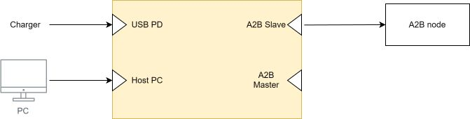
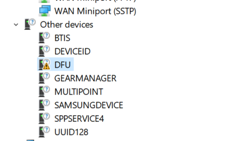

# Home


[TOC]

## Device overview

The A2Bridge is used to transmit or receive the audio via USB to A2B
bus. It can be configured to be used either as an A2B master or slave.
After the device is connected to PC it is present as an external USB
audio device and audio can easily be transmitted to it in the same way
as it is transmitted to any other connected speaker.

After the device is successfully connected to the host PC it will be
presented as 4 USB endpoints:  
- External audio device  
- Mass storage device  
- DFU  
- Virtual COM port


External audio device endpoints are used to transmit or receive audio
data to A2Bridge.

Device can be in 3 different states:

| status      | LED color | Description                          |
| ----------- | ----------- | ------------------------------------ |
| `ERROR`     |  <span style="color:red">RED</span>|Device is in runtime unrecoverable error (ie. unexpected node drop).  **Audio output is fully muted in that state.**  |
| `IMPAIRED`       |  <span style="color:yellow">YELLOW</span>| Device is in an impaired state (ie. not all configured slaves were discovered).  State can be recovered ie. by doing rediscovery of the bus via console.    **Audio output is fully muted in that state.**       |
| `NORMAL`    |  <span style="color:green">GREEN</span>| The device is fully operational.                     |

Each state has a corresponding LED color.

There are 2 USB ports available.  
**Host PC -** this port is obligatory for A2Bridge↔︎ PC communication.

**Power USB PD** - this port is optional, used for extra power for the
device. Device requires significant amounts of power, especially while
used with bus-powered sub-nodes. Not all USB ports might deliver enough
power (USB 2.0 ports). It is recommended to connect device to USB-PD
port on your device, in that case single USB connection is sufficient.
In all other cases please connect one USB to the PC and another to a PD
capable charger.

For A2B bus communication there are 2 ports available:  
**A2B Master** - This is the port used for communication with previous
A2B sub-node(towards main node). *Should be used only in the slave
mode.*

**A2B Slave** - This port is used for communication with next A2B
sub-node(towards next sub-node). *Can be used in both Master and Slave
modes.*



### Windows setup

By default, Windows OS cannot transmit more than 2 output channels to
the output. To use more than 2 output channels additional drivers need
to be installed (Check [Download – ASIO4ALL Official
Home](https://asio4all.org/about/download-asio4all/)). After
installation of additional drivers, it can be used in programs like
Audacity or ocenaudio.

## DFU firmware update

Device firmware can be updated via USB using DFU.

### DFU on Windows

After the first connection of the A2Bridge, the DFU node will be marked
as an unknown device and will miss the driver.



Windows by default does not support standard DFU class of USB. Driver
must be replaced.

Replace(install) driver using Zadig: <https://zadig.akeo.ie/>


### Driver Linux

Linux supports DFU out of the box, no driver replacement is needed.

### Flashing

For DFU flashing use **dfu-util** tool. Example command:

```
dfu-util.exe --download .\UA2B\_cm7.bin.dfu --reset
```

*NOTE: File with \*.dfu extension is a special file prepared during
build - it contains metadata for DFU flashing, including information's
to which device the update should go.*

**Log of successful updates:**

```
Match vendor ID from file: cafe
Match product ID from file: 2001
Opening DFU capable USB device...
Run-Time device DFU version 0101
Claiming USB DFU Interface...
Setting Alternate Interface \#0 ...
Determining device status...
DFU state(2) = dfuIDLE, status(0) = No error condition is present
DFU mode device DFU version 0101
Device returned transfer size 512
Copying data from PC to DFU device
Download [=========================] 100% 199200 bytes
Download done.
DFU state(7) = dfuMANIFEST, status(0) = No error condition is present
DFU state(8) = dfuMANIFEST-WAIT-RESET, status(0) = No error condition is
present
Resetting USB to switch back to runtime mode
Done!
```
