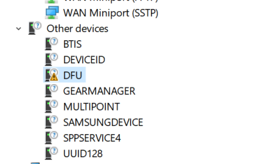

# Firmware Update

Device firmware can be updated via USB using DFU (**D**evice **F**irmware **U**pgrade).

## DFU on Windows

After the first connection of the A2Bridge, the DFU node will be marked
as an unknown device and will miss the driver.



Windows by default does not support standard DFU class of USB. Driver
must be replaced.

Replace(install) driver using Zadig: <https://zadig.akeo.ie/>


## DFU on Linux

Linux supports DFU out of the box, no driver replacement is needed.

## Flashing

For DFU flashing use **dfu-util** tool. Example command:

```
dfu-util.exe --download .\UA2B\_cm7.bin.dfu --reset
```

*NOTE: File with \*.dfu extension is a special file prepared during
build - it contains metadata for DFU flashing, including information's
to which device the update should go.*

**Log of successful updates:**

```
Match vendor ID from file: cafe
Match product ID from file: 2001
Opening DFU capable USB device...
Run-Time device DFU version 0101
Claiming USB DFU Interface...
Setting Alternate Interface \#0 ...
Determining device status...
DFU state(2) = dfuIDLE, status(0) = No error condition is present
DFU mode device DFU version 0101
Device returned transfer size 512
Copying data from PC to DFU device
Download [=========================] 100% 199200 bytes
Download done.
DFU state(7) = dfuMANIFEST, status(0) = No error condition is present
DFU state(8) = dfuMANIFEST-WAIT-RESET, status(0) = No error condition is
present
Resetting USB to switch back to runtime mode
Done!
```