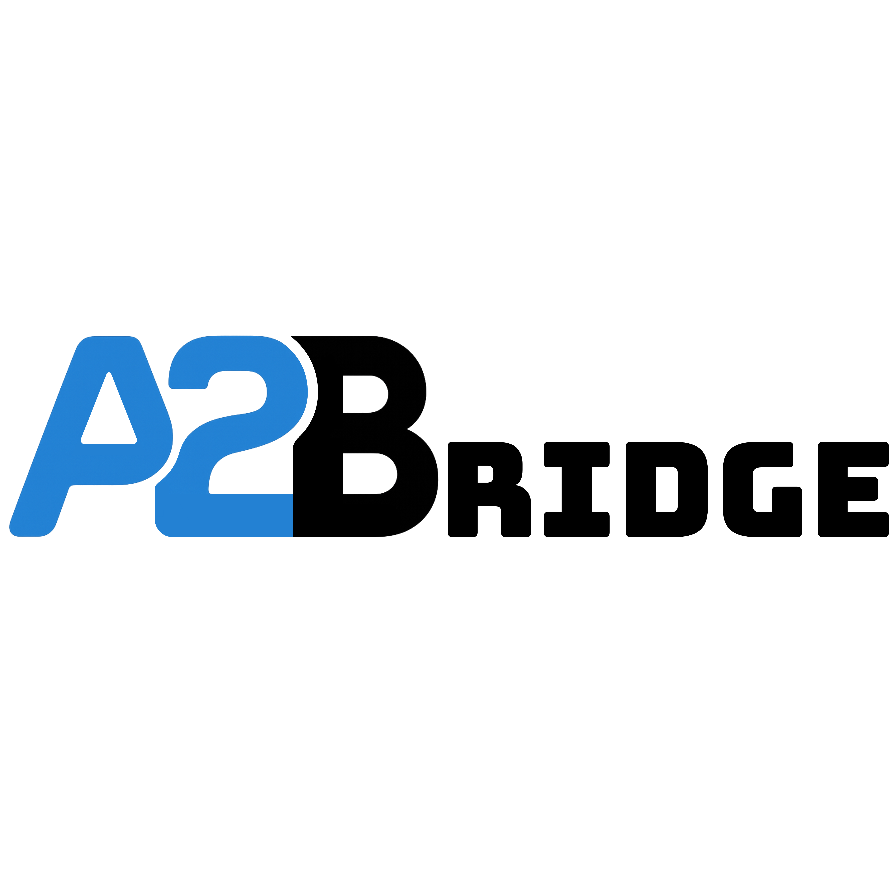
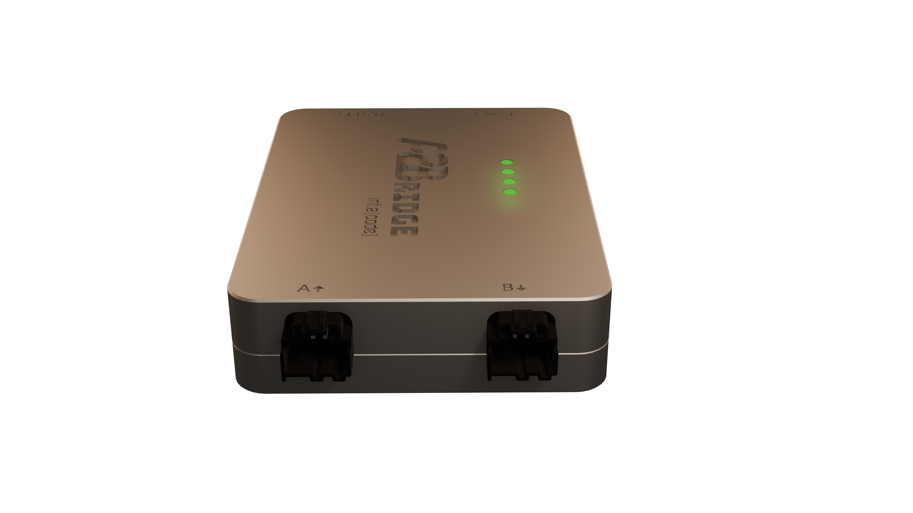

# Home
{: style="height:200px;width:200px"}

## Device overview

The A2Bridge is used to transmit or receive the audio via USB to A2B
bus. It can be configured to be used either as an A2B master or slave.
A2Bridge is a tool which might be used by developers and tested to test their A2B devices like amplifiers.

{: style="display:block; margin: 2rem auto; width: 60%;"}

## Capabilities

1. **A2B Master device** - 
Our device supports an A2B master with a user-defined bus topology. It enables bidirectional communication across up to 32 channels, allowing seamless data exchange between USB and A2B interfaces.

2. **A2B Slave device** -
A2Bridge can be used in test bench environments where it is necessary to simulate an A2B sub-node.

3. **Control A2B transceivers and nodes with your PC** -
With A2Bridge, users can develop and execute custom desktop-based test applications to configure the A2B transceiver and associated I²C peripherals. We provide a lightweight Python API that enables I²C-over-distance communication, allowing users to read from and write to peripheral I²C registers with ease.

4. **Support mailboxes** - 
Developers can test device communication with the head unit using our A2B mailbox, with support provided through Python and Protobuf.

## Hardware description

This section describes the device hardware. The device has two USB-C ports, four LEDs, and two A2B ports.

### Device status

There are 4 LEDs which are used to signalize the current status of device

Device can be in 3 different states which is represented **LED 1** (see the image below) on the board:
{: style="display:block; margin: 2rem auto; width: 30%;"}
*LED_1* 

| status      | LED color | Description                          |
| ----------- | ----------- | ------------------------------------ |
| `ERROR`     |  RED|Device is in runtime unrecoverable error (ie. unexpected node drop).  **Audio output is fully muted in that state.**  |
| `IMPAIRED`       |  YELLOW| Device is in an impaired state (ie. not all configured slaves were discovered).  State can be recovered ie. by doing rediscovery of the bus via console.    **Audio output is fully muted in that state.**       |
| `NORMAL`    |  GREEN| The device is fully operational.                     |

Each state has a corresponding LED color.

**LED 4** indicates the current state of the Power Delivery port
{: style="display:block; margin: 2rem auto; width: 30%;"}
*LED_4* 

| status             | LED color                                | Description                          |
| ------------------ | ---------------------------------------- | ------------------------------------ |
| `DISCONNECTED`     |  BLUE    | No power supply is connected to USB PD port |
| `NO MATCHING PDU`  |  YELLOW| Power supply is connected but it can not provide the voltage configured with "SupplyVoltage" property in Json configuration      |
| `NORMAL`           |  GREEN  | Power supply connected and provides the voltage configured with SupplyVoltage property                    |

### A2B Ports

{: style="display:block; margin: 2rem auto; width: 50%;"}
*A2Bridge A2B ports* 

For A2B bus communication there are 2 ports available:  
**A** (A2B Master) - This is the port used for communication with previous
A2B sub-node(towards main node). *Should be used only in the slave
mode.*

**B** (A2B Slave) - This port is used for communication with next A2B
sub-node(towards next sub-node). *Can be used in both Master and Slave
modes.*

### USB Ports

{: style="display:block; margin: 2rem auto; width: 60%;"} 
*A2Bridge USB ports* 

There are two USB ports:

- **Host PC** port is used to communicate with Desktop and transmit or receive audio data

- **Power** is used to supply phantom power over A2B. The connected power supply must support the USB Power Delivery (PD) protocol, and the user can configure the requested voltage using a JSON configuration file.

## USB Communication

After the device is successfully connected to the host PC it will be
presented as 4 USB endpoints:  
- External audio device  
- Mass storage device  
- DFU  
- Virtual COM port

External audio device endpoints are used to transmit or receive audio
data to A2Bridge.

There are 2 USB ports available.  
**Host PC -** this port is obligatory for A2Bridge↔︎ PC communication.

**Power USB PD** - this port is optional, used for extra power for the
device. Device requires significant amounts of power, especially while
used with bus-powered sub-nodes. Not all USB ports might deliver enough
power (USB 2.0 ports). It is recommended to connect device to USB-PD
port on your device, in that case single USB connection is sufficient.
In all other cases please connect one USB to the PC and another to a PD
capable charger.

