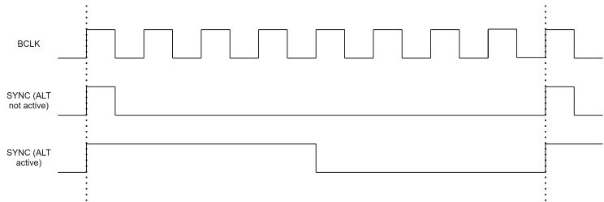
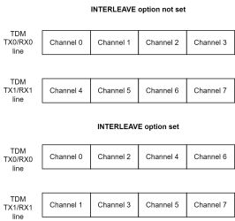

# JSON configuration

The mass storage class USB endpoint is used to pass the needed A2B configuration as a JSON file. 
To access it, opens the CONFIG.A2B file. **Please be aware that JSON configuration is case sensitive.** By default, it contains the following configuration:

```json
{
    "Version": "x.xx",
    "Name": "Default",
    "ResetOnNew": "True",
    "A2BRole": "Master",
    "AudioResolution": 16,
    "UsbInputChannels": 2,
    "UsbOutputChannels": 2,
    "RunInProtobufMode": "True",
    "SupplyVoltage": 5000,
    "AudioRouteMatrixDownstream": [
      [1],
      [2],
    ],
    "AudioRouteMatrixUpstream": [
      [1],
      [2],
    ],
    "A2BMasterConfig" : {
      "SlavesOnBus": 1,
      "DnSlots": 8,
      "UpSlots": 8,
      "AutoDiscovery": "False",
      "SlaveConfiguration":[
        {
          "Node": 0,
          "DnSlots": 0,
          "LocalDnSlots": 8,
          "UpSlots": 0,
          "LocalUpSlots": 8,
          "PowerConfig": "High",
          "CableLength": 4,
          "ConfigureTDM": "True",
          "TdmTxLines": 1,
          "TdmRxLines": 1,
          "TDMMode": "TDM8",
          "TDMOptions": ["EARLY", "INV", "ALT"]
        }
      ]
    },
    "A2BSlaveConfig":
    {
      "TdmRxChannels": 1,
      "TdmTxChannels": 1
    }
}
```

To configure the A2Bridge the following options can be changed.

## Version 
The version of the JSON configuration. It needs to be
compatible with A2Bridge. The user does not need to change it.  
  
## Name
The name of the configuration. Users can change it to save the configuration title.

## ResetOnNew 
This option is used to configure the behavior on new
configuration save. If it is set to True the device will be reset on new
configuration uploaded.  
  
## A2BRole 
Option to configure the A2B role. It can be set to one of
these options: “Master” or “Slave”  
  
## AudioResolution 
Audio resolution in bits per sample.  
  
## UsbInputChannels 
Number of channels that are send to the device
from the PC.  
  
## UsbOutputChannels 
Number of channels that are send to the PC from A2Bridge box.  

## RunInProtobufMode 
If this option is set, A2Bridge will start automatically in protobuf COM port mode.

## SupplyVoltage 
Voltage in mV requested to supply connected to USB power delivery port. This voltage will be transfered to A2B bus.
  
## AudioRouteMatrixDownstream 
Matrix of the channels transmitted to the A2B bus. Each row is an output channel from the USB interface and each element within a row is an A2B output channel to which the corresponding USB channel’s audio will be routed.
```json
"AudioRouteMatrixDownstream": [
    [A2B Channel, A2B Channel …], - Channel 1 coming from USB
    [A2B Channel, A2B Channel …], - Channel 2 coming from USB
    …
],
```

As an example we will create the configuration in which there will be 3 USB input channels and 10 A2B output channels. We want to forward 1st USB channel to A2B channels: 1,2,3,4,5,6. 2nd USB channel will be forwarded to 7,8 A2B channels and the last 3rd channels will be forwarded to 9th A2B channel.

```json
"AudioRouteMatrixDownstream": [
    [1, 2, 3, 4, 5, 6], - USB Channel 1 -> A2B Channels 1,2,3,4,5,6
    [7, 8], - USB Channel 2 -> A2B Channels 7,8
    [9] - USB Channel 3 -> A2B Channel 9
]
```

## AudioRouteMatrixUpstream 
Matrix of the channels received from A2B bus and transmitted to USB bus. Each row represents A2B channel received from the bus and each element within a row is an USB output channel number.

!!! info Attention:

    It works opposite to AudioRouteMatrixDownstream.
  

## A2BMasterConfig 
Contains the configuration used when the device is
set to “Master” mode.  
  
### SlavesOnBus 
Number of slaves available on A2B bus.  
  
### DnSlots 
Number of down slots going out from the device.  
  
### UpSlots 
Number of the up slots coming to the device.  

### AutoDiscovery
Setting this flag to true will cause the A2B discovery to be triggered every 500ms as long as the A2Bridge doesn't reach the Normal state (A2B discovery successful)
  
### SlaveConfiguration 
Contains the table of the slave configurations. Each slave configuration should contain following properties:

#### Node 
Node number. The order of the node counting from 0

#### DnSlots 
Number of channels forwarded downward.

#### LocalDnSlots
Number of the slots coming from the upper-node consumed by the current node.

#### UpSlots
Number of slots forwarded upward.

#### LocalUpSlots
Number of slots produced by current node. The number of slots send up to the upper node (to master direction) is equal to UpSlots + LocalUpSlots

#### UpstreamReceiveSlots
Optional array of 0-based upstream slot indexes received locally by this node from its B-port and transmitted on the local I2S/TDM DTX pins. An empty or missing array disables local upstream slot receive. For example, `[0, 1]` programs `A2B_UPMASK0 = 0x03`.

#### DownstreamReceiveSlots
Optional array of 0-based downstream slot indexes received locally by this node from its A-port and transmitted on the local I2S/TDM DTX pins. An empty or missing array disables downstream mask mode. A non-empty array programs `A2B_DNMASK0` through `A2B_DNMASK3` and enables `A2B_LDNSLOTS.DNMASKEN`.

#### UpstreamOffset
Optional local upstream channel offset. It programs `A2B_UPOFFSET` and is used when this node contributes `LocalUpSlots` from its local I2S/TDM/PDM RX frame buffer.

#### DownstreamOffset
Optional local downstream channel offset. It programs `A2B_DNOFFSET` and is used when this node contributes local downstream slots in downstream mask mode.

Example: a middle node that forwards existing traffic, receives selected slots locally, and contributes its own slots:

```json
{
  "Node": 1,
  "DnSlots": 4,
  "LocalDnSlots": 2,
  "UpSlots": 2,
  "LocalUpSlots": 2,
  "UpstreamReceiveSlots": [0, 1],
  "DownstreamReceiveSlots": [0, 3],
  "UpstreamOffset": 4,
  "DownstreamOffset": 2,
  "PowerConfig": "High",
  "CableLength": 4,
  "ConfigureTDM": "True",
  "TdmTxLines": 1,
  "TdmRxLines": 1,
  "TDMMode": "TDM8",
  "TDMOptions": ["EARLY", "INV", "ALT"]
}
```

In this example the upstream direction works as follows:

- `UpSlots: 2` forwards upstream slots 0 and 1 from the B-port toward the master on the A-port.
- `UpstreamReceiveSlots: [0, 1]` also copies those forwarded upstream slots into the local TX frame buffer, so they can be transmitted on the node local DTX/I2S/TDM pins.
- `LocalUpSlots: 2` appends two locally produced upstream slots after the forwarded slots.
- `UpstreamOffset: 4` means the local contribution starts from local RX frame buffer channel 4. The node therefore contributes local channels 4 and 5 as upstream slots 2 and 3.

The upstream bus after this node is:

```text
upstream slot 0 = forwarded slot 0 from the next node
upstream slot 1 = forwarded slot 1 from the next node
upstream slot 2 = local RX frame buffer channel 4
upstream slot 3 = local RX frame buffer channel 5
```

The downstream direction uses the mask mode:

- `DnSlots: 4` forwards downstream slots 0 through 3 from the A-port to the B-port.
- `DownstreamReceiveSlots: [0, 3]` locally receives only downstream slots 0 and 3 and outputs them on the local DTX/I2S/TDM pins.
- Because `DownstreamReceiveSlots` is not empty, the driver enables `LDNSLOTS.DNMASKEN`. In this mode, `LocalDnSlots` no longer means "consume this many downstream slots"; it means "contribute this many local downstream slots".
- `LocalDnSlots: 2` appends two locally produced downstream slots after the forwarded downstream slots.
- `DownstreamOffset: 2` means the local downstream contribution starts from local RX frame buffer channel 2. The node therefore contributes local channels 2 and 3 as downstream slots 4 and 5.

The downstream bus after this node is:

```text
downstream slot 0 = forwarded slot 0 from the master
downstream slot 1 = forwarded slot 1 from the master
downstream slot 2 = forwarded slot 2 from the master
downstream slot 3 = forwarded slot 3 from the master
downstream slot 4 = local RX frame buffer channel 2
downstream slot 5 = local RX frame buffer channel 3
```

If `DownstreamReceiveSlots` is empty or missing, `LDNSLOTS.DNMASKEN` is not enabled and `LocalDnSlots` keeps the simple legacy meaning: the number of downstream slots consumed locally by the node.

#### PowerConfig 
Power configuration. Can be set to one of those values: **High** or **Low**

#### CableLength
Length of the cable to the upper node.

#### ConfigureTDM
If this option is set the slave TDM configuration will be set by A2Bridge. Can be set to False if the node is configured by itself.

#### TdmTxLines
Number of TDM TX lines coming from the node (from A2B transceiver to the slave µC)

#### TdmRxLines
Number of TDM RX lines coming to the node (from slave µC to slave A2B transceiver)

#### TDMMode 
TDM mode. Should be set to the one of the following values:
**TDM2, TDM4, TDM8, TDM12, TDM16, TDM20, TDM24, TDM32.** 
TDMx is a property which describes the number of channels in one TDM frame.

#### TDMOptions
Additional TDM configuration. This is the table of flags used for TDM communication.
##### EARLY 
SYNC pin changes one cycle before the MSB of data channel 0

##### ALT 
When not set SYNC pin is active for one BCLK cycle at the start of each sampling period, otherwise SYNC is active for 50% of sampling period



##### INV 
Invert Sync signal. When set falling edge of sync references the first channel otherwise it is rising edge.

##### RXBCLKINV 
When this flag is set DRX signal is sampled on falling
  edge of BCLK.

##### TXBCLKINV 
When this flag is set DTX pin is changed on the falling edge of BCLK.

##### TDMSS 
when this flag is set the slaves TDM slot length is 16 bits; 32 bits otherwise

##### INTERLEAVE 
When this option is set, the channels are interleaved between TDM lines.



## A2BSlaveConfig 
contains the following options used when A2BRole set to Slave:

#### TdmRxChannels
Number of TDM RX channels (from A2B transceiver to slave µC)

#### TdmTxChannels
Number of TDM TX channels (from slave µC to A2B transceiver)
