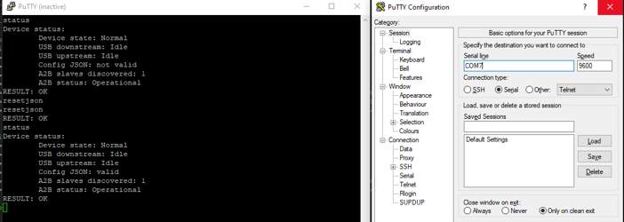

# Serial COM port communication

## Human readable console

After connecting to Host PC the A2Bridge will register in your PC a virtual COM port which can be used as a regular serial port for communicating with the A2Bridge over command line or python library. Since it is USB virtual COM port **the baud rate can be set to any value.** 

Under Windows OS you can find the number of the COM port in the device manager. 
As a tool to work with the A2Bridge we suggest [teraterm](https://github.com/TeraTermProject/teraterm) since, opposite to PuTTY, it doesn't request restarting the session every time the new configuration of the Bridge will be stored and the device restarts. 

Under linux OS, you can find the corresponding serial port under `/dev/ttyACMx`. You can use 




There are few commands available on COM console depending on the A2B mode configured.

### Console commands in A2B Master mode.

**Following console commands are available in Master mode:**
#### help 
Prints all available command's help. 

#### reset 
Resets the device. Invoking this command will cause the device to get disconnected from Host PC and reconnected after a while. 

#### info 
Prints the information about the device
```bash
A2Bridge:~$ info
Hardware revision: 1
Software version: v3.0.2-3-g0f3fe09-dirty
Serial number: 000000030
Chip used: AD2435
RESULT: OK
A2Bridge:~$
```

#### status 
Prints the status of the device. Contains the information about the number of slaves discovered and current A2B status.
```bash
A2Bridge:~$ status
Device status:
        Device state: Impaired
        USB downstream: Idle
        USB upstream: Idle
        Config "Default" JSON: valid
        A2B Cable diagnostic: No fault detected
        Power Delivery: disconnected
        A2B slaves discovered: 0
        A2B status: Fault - timeout, at slave: 0
RESULT: OK
A2Bridge:~$ 
```
The `Device state` can have following values:
- `Imparied` not all slaves configured to be present on the bus have been discovered 
- `Normal` all configured slaves have been discovered and connected, ready to play audio ove A2B 
- `Error` the device detected either configuration, A2B bus or internal error and must be restarted 


The `USB downstream` & `USB upstream` can have values:
- `Idle` the host is not streaming audio data over the USB 
- `Streaming` the host is streaming data over the USB 

#### resetjson 
resets the CONFIG.A2B Json file to default one.

#### discover
Triggers the A2B bus discovery process

#### switchproto
Switches COM port to protobuf mode.
!!! info Attention:
    After calling this command you will be not able to use command line until reset of the device (assuming the corresponding configuration is set to command line - see [RunInProtobufMode](json.md/#runinprotobufmode))


#### loglevel
Changes the log level. Must to be set to one of these values - "off", "debug, "info", "warning", "error". You can change the log level also using the configuration file.
Changes done over command line will be not stored in the device. After restart the log level will be reset to the level configured in the config file. 

#### regs
Prints the A2B transceiver registers and its values. If the number of subnode is provided (in master mode) then prints the register values from the subnode transceiver.
Usage: 
```bash
A2Bridge:~$ regs
...
A2Bridge:~$ regs 0
```

#### setreg
Writes a single 8-bit A2B transceiver register. This command is available only in A2B Master mode.

To write a register of the local master transceiver, provide the register address and value:

```bash
A2Bridge:~$ setreg 0x41 0x11
```

To write a register of a slave transceiver, additionally provide its zero-based node number:

```bash
A2Bridge:~$ setreg 0 0x41 0x11
```

The node number, register address, and value are parsed as 8-bit numbers in the range `0..255`. The node number must identify an existing slave. Decimal and hexadecimal notation are accepted.

The command performs a raw register write. It does not check whether the selected register is writable and it does not store the change in the device configuration. A later discovery, reconfiguration, or device reset may overwrite the value. Refer to the A2B transceiver documentation before writing a register.


### Console commands in A2B Slave mode.

**Following console commands are available in Slave mode:**

#### reset 
Resets the device

#### info
Prints the information about the device

#### status
Prints the status of the device.

#### resetjson
Resets the CONFIG.A2B Json file to default one.

#### switchproto
Switches COM port to protobuf mode

## Protobuf mode

Device can be switch to use the binary communication over protobuf protocol. In that case the ready to use python library available under: [XAudio Lib](https://github.com/int2code/xaudio)

### Reset
Resets the device

#### **Message properties**
None
#### **Response**
Positive or negative response.


### Status
Sends the response with current status of the device depending on the A2B Role

#### **Message properties**
None

#### **Response**

Common for slave and Master mode:

**usb_audio_downstream_state** - Enumerate with current downstream USB state. Contains one of the following values:


```
    USB_AUDIO_STREAM_STATE_UNSPECIFIED = 0;
    USB_AUDIO_STREAM_STATE_IDLE = 1;
    USB_AUDIO_STREAM_STATE_STREAMING = 2;
```
 

**usb_audio_upstream_state** - Enumerate with current upstream audio USB state. 


```
  USB_AUDIO_STREAM_STATE_UNSPECIFIED = 0;
  USB_AUDIO_STREAM_STATE_IDLE = 1;
  USB_AUDIO_STREAM_STATE_STREAMING = 2;
```

**device_state** - enumerate with current device status

```
  DEVICE_STATE_UNSPECIFIED = 0;
  DEVICE_STATE_BOOT = 1;
  DEVICE_STATE_NORMAL = 2;
  DEVICE_STATE_IMPAIRED = 3;
  DEVICE_STATE_ERROR = 4;
```
**config_json_state** - enumerate with current json config status

```
  CONFIG_JSON_STATE_UNSPECIFIED = 0;
  CONFIG_JSON_STATE_VALID = 1;
  CONFIG_JSON_STATE_INVALID = 2;
```

Master:


**A2bFault** - (optional) Structure containing the information about existing fault in A2B transceiver. This message has following properties:

**fault** - enumerate with current fault type on A2B transceiver


```
  LIBAD243X_FAULTTYPE_NONE = 0,
  LIBAD243X_FAULTTYPE_BECOVF = 1,
  LIBAD243X_FAULTTYPE_SRF_MISS = 2,
  LIBAD243X_FAULTTYPE_PWR_SHRT2GND = 3,
  LIBAD243X_FAULTTYPE_PWR_SHRT2VBAT = 4,
  LIBAD243X_FAULTTYPE_PWR_SHRT2GTHR = 5,
  LIBAD243X_FAULTTYPE_PWR_OPEN = 6,
  LIBAD243X_FAULTTYPE_PWR_REVERSE = 7,
  LIBAD243X_FAULTTYPE_PWR_OTHER = 8,
  LIBAD243X_FAULTTYPE_PWR_NL_SHRT2GND = 9,
  LIBAD243X_FAULTTYPE_PWR_NL_SHRT2VBAT = 10,
  LIBAD243X_FAULTTYPE_TIMEOUT = 11,
  LIBAD243X_FAULTTYPE_MSTR_RESET = 12,
  LIBAD243X_FAULTTYPE_OTHER = 13,
```

**location** - enumerate containing the location of fault source


```
LIBAD243X_FAULTSOURCE_MASTER = 0,
LIBAD243X_FAULTSOURCE_SLAVE = 1,
```
**slave_with_fault** - (optional) If the fault source is slave contains the slave index.

**a2b_slaves_discovered** - number of slaves discovered

Slave:

a2b_state - A2B slave state


  SLAVE_A2B_STATE_UNSPECIFIED = 0;
  SLAVE_A2B_STATE_INIT = 1;
  SLAVE_A2B_STATE_WAIT_DISCOVER = 2;
  SLAVE_A2B_STATE_READY = 3;
  SLAVE_A2B_STATE_NOT_READY = 4;
Info - Request information about the device
**Message properties:**
None
**Response:**

**hardware_revision** - Hardware revision number

**software_revision** - String with software revision

**serial_number** - String with serial number

 

### A2BDiscoveryRequest 
Request A2B bus slave re-discovery

#### **Message properties**

None

#### **Response**
Positive or negative

 

### I2cOverDistance 
Send I2C command over A2B bus to one of the slaves or its peripheral.

#### **Message properties**

**I2cOverDistanceAccessType** - Access type enumerate:


```
  I2C_OVER_DISTANCE_UNSPECIFIED = 0;
  I2C_OVER_DISTANCE_WRITE = 1;
  I2C_OVER_DISTANCE_READ = 2;
```
**peripheral_i2c_addr**  - (optional) if this property is set I2C message will be forwarded to slaves perihperal.

**node** - the index of the node to which the message will be sent or read.

**Data** - Data to send or read 

**reg** - Register to read/write

**value** - Value to write in case of I2C_OVER_DISTANCE_WRITE access type

#### **Response:**

**access_type** - Access type enumerate:


  I2C_OVER_DISTANCE_UNSPECIFIED = 0;
  I2C_OVER_DISTANCE_WRITE = 1;
  I2C_OVER_DISTANCE_READ = 2;
**value** - the value read from the register

### SetRegisterRequest

Writes a single 8-bit A2B transceiver register. This request is supported in A2B Master mode only.

#### **Message properties**

**node_number** - Optional, zero-based slave node number. If this field is omitted, the register is written on the local master transceiver. If it is present, the register is written on the selected slave transceiver over A2B.

**reg** - Register address. The valid message range is `0..255`.

**value** - Value written to the register. The valid message range is `0..255`.

When `node_number` is present, it must identify a slave that is available on the current A2B bus.

To write register `0x41` on the local master transceiver using the generated Python interface:

```python
request = interface_pb2.RequestPacket()
request.set_register_request.reg = 0x41
request.set_register_request.value = 0x11
```

To write the same register on slave node `0`:

```python
request = interface_pb2.RequestPacket()
request.set_register_request.node_number = 0
request.set_register_request.reg = 0x41
request.set_register_request.value = 0x11
```

Because `node_number` is an optional field, assigning `0` explicitly targets the first slave. Leaving the field unset selects the local master transceiver.

#### **Response**

A positive response with no data is returned after a successful write. A negative response is returned when the request cannot be decoded, a field is outside the 8-bit range, or the register write fails.

The request performs a raw register write and does not verify whether the register is writable. It also does not make the value persistent; discovery, reconfiguration, or device reset may overwrite it.

### A2BMailboxTransfer 
Request to read/write A2B mailbox.

#### **Message properties**

**mailbox_id** - Mailbox identifier

**access_type** - Access type enumerate:

```
  A2B_MAILBOX_ACCESS_TYPE_UNSPECIFIED = 0;
  A2B_MAILBOX_ACCESS_TYPE_WRITE = 1;
  A2B_MAILBOX_ACCESS_TYPE_READ = 2;
```
**node** - node identifier to which the message will be sent/read.

**bytes** - length of the mailbox message (has to be lower than 4 bytes)

#### **Response**

**mailbox_id** - Mailbox identifier

**access_type** - Access type enumerate:


```
  A2B_MAILBOX_ACCESS_TYPE_UNSPECIFIED = 0;
  A2B_MAILBOX_ACCESS_TYPE_WRITE = 1;
  A2B_MAILBOX_ACCESS_TYPE_READ = 2;
```
**access_status** - Status of the read/write to mailbox.


```
  A2B_MAILBOX_STATUS_UNSPECIFIED = 0;
  A2B_MAILBOX_STATUS_OK = 1;
  A2B_MAILBOX_STATUS_GENERAL_FAIL = 2;
  A2B_MAILBOX_STATUS_NOT_EMPTY = 3;
  A2B_MAILBOX_STATUS_NOT_FULL = 4;
```
**data** - data read from the mailbox
