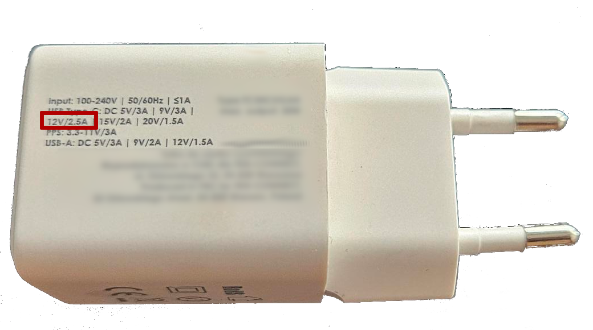
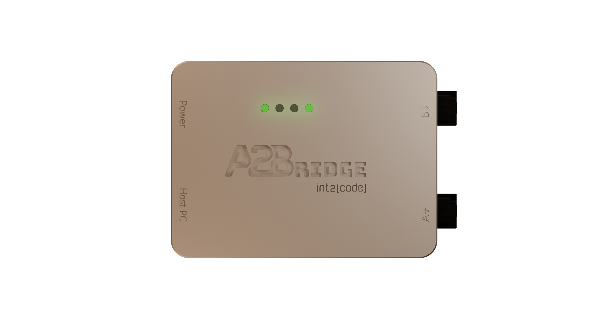
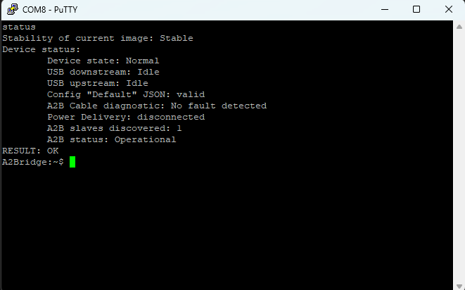
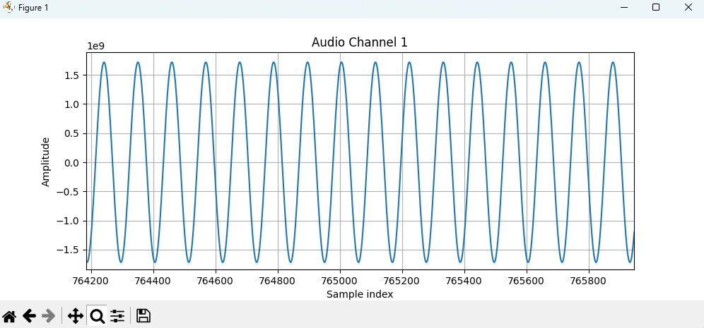
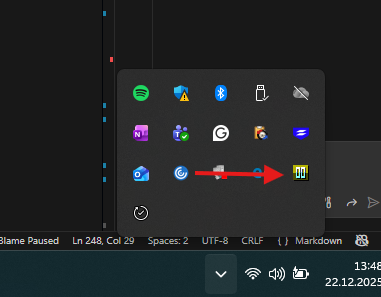
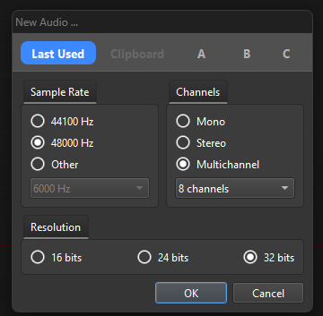

# Setup

## Windows setup

By default, Windows OS cannot transmit more than 2 output channels to
the output. To use more than 2 output channels additional drivers need
to be installed (Check [Download – ASIO4ALL Official
Home](https://asio4all.org/about/download-asio4all/)). After
installation of additional drivers, it can be used in programs like Audacity or ocenaudio.

!!! info inline end "Attention:"
    A2Bridge can be used either with Python and WDM-KS drivers (preferred option) using libraries such as sounddevice, or with ASIO-based applications.


## Linux setup

Linux can handle multiple audio channels natively without requiring any additional drivers.

## A2Bridge as a master

This guide prepares a test configuration that transmits 8 downstream channels and receives 4 upstream channels using 32-bit audio resolution. The slave device must be powered using 12 V phantom power.

Connect the A2Bridge as shown in the provided example diagram. Phantom power is delivered using a USB charger.
{: style="display:block; margin: 2rem auto; width: 60%;"} <p style="text-align:center;">*Master Configuration example with phantom power delivered by USB charger* </p>

Once connected to the PC, the A2Bridge appears as a mass storage device. Open this device and edit the CONFIG.TXT file.
{: style="display:block; margin: 2rem auto; width: 60%;"} <p style="text-align:center;">*A2Bridge as a mass storage device in Windows* </p>

``` json
{
    "Version": "1.31",
    "Name": "Default",
    "ResetOnNew": "True",
    "A2BRole": "Master",
    "AudioResolution": 16,
    "UsbInputChannels": 2,
    "UsbOutputChannels": 2,
    "RunInProtobufMode": "False",
    "SupplyVoltage": 5000,
    "AudioRouteMatrixDownstream": [
      [1],
      [2],
    ],
    "AudioRouteMatrixUpstream": [
      [1],
      [2],
    ],
    "A2BMasterConfig" : {
      "SlavesOnBus": 1,
      "DnSlots": 8,
      "UpSlots": 8,
      "SlaveConfiguration":[
        {
          "Node": 0,
          "DnSlots": 0,
          "LocalDnSlots": 8,
          "UpSlots": 0,
          "LocalUpSlots": 8,
          "PowerConfig": "High",
          "CableLength": 4,
          "ConfigureTDM": "True",
          "TdmTxLines": 1,
          "TdmRxLines": 1,
          "TDMMode": "TDM8",
          "TDMOptions": ["EARLY", "INV", "ALT"]
        }
      ]
    },
    "A2BSlaveConfig":
    {
      "TdmRxChannels": 1,
      "TdmTxChannels": 1
    }
}
```

The configuration file needs to be modified according to our needs. The first thing that we need to check is the A2BRole parameter.
``` json
    "A2BRole": "Master",
```
As it is by default set to Master we don't need to change it.

The next thing we need to check is the audio configuration and number of channels 
``` json
    "AudioResolution": 16,
    "UsbInputChannels": 2,
    "UsbOutputChannels": 2,
```
It needs to be changed to 
``` json
    "AudioResolution": 32,
    "UsbInputChannels": 8,
    "UsbOutputChannels": 4,
```
as audio resolution we need is 32 bit and we are going to transmit 8 channels down and receive 4 channels from slave. 
The **SupplyVoltage** has to be configured to 12000 (value in mV) as we need 12V phantom power.
!!! note ""

    Please remember that not all of the USB PD chargers support 12V. To verify if your charger does please read the rating plate of your USB charger.
    {: style="display:block; margin: 2rem auto; width: 60%;"} <p style="text-align:center; font-size: 15px; font-style: italic;">USB charger supporting 12V</p>


The next we are going to prepare audio routing matrices. We are going to transmit each USB channel to corresponding A2B channels so the matrix is going to be simple.
``` json
    "AudioRouteMatrixDownstream": [
      [1],
      [2],
	  [3],
      [4],
	  [5],
      [6],
	  [7],
	  [8]
    ],
    "AudioRouteMatrixUpstream": [
      [1],
      [2],
	  [3],
      [4],
    ],
```
{: style="display:block; margin: 2rem auto; width: 20%;"} <p style="text-align:center; font-size: 15px; font-style: italic;">Routing matrix visualization</p>

Next the A2B bus and slaves need to be configured.

```
    "A2BMasterConfig" : {
      "SlavesOnBus": 1, <- There is one slave on our bus
      "DnSlots": 8,  <- 8 channels downstreamed
      "UpSlots": 4, <- 4 channels upstreamed to usb
      "SlaveConfiguration":[
        {
          "Node": 0, // <- Node number starting from 0
          "DnSlots": 0, // <- Number of channels send down
          "LocalDnSlots": 8, // <- Number of channels consumed by node
          "UpSlots": 0, <- Number of channels forwarded from down to up
          "LocalUpSlots": 4, <- number of channels produced by the node
          "PowerConfig": "Low",
          "CableLength": 4,
          "ConfigureTDM": "True",
          "TdmTxLines": 1,
          "TdmRxLines": 1,
          "TDMMode": "TDM8",
          "TDMOptions": ["EARLY", "INV", "ALT"]
        }
      ]
    }
```

So in the end we have following configuration

``` json
{
    "Version": "1.31",
    "Name": "Default",
    "ResetOnNew": "True",
    "A2BRole": "Master",
    "AudioResolution": 32,
    "UsbInputChannels": 8,
    "UsbOutputChannels": 4,
    "RunInProtobufMode": "False",
    "SupplyVoltage": 12000,
    "AudioRouteMatrixDownstream": [
      [1],
      [2],
	  [3],
      [4],
	  [5],
      [6],
	  [7],
	  [8]
    ],
    "AudioRouteMatrixUpstream": [
      [1],
      [2],
	  [3],
      [4],
    ],
    "A2BMasterConfig" : {
      "SlavesOnBus": 1,
      "DnSlots": 8,
      "UpSlots": 4,
      "SlaveConfiguration":[
        {
          "Node": 0,
          "DnSlots": 0,
          "LocalDnSlots": 8,
          "UpSlots": 0,
          "LocalUpSlots": 4,
          "PowerConfig": "High",
          "CableLength": 4,
          "ConfigureTDM": "True",
          "TdmTxLines": 1,
          "TdmRxLines": 1,
          "TDMMode": "TDM8",
          "TDMOptions": ["EARLY", "INV", "ALT"]
        }
      ]
    },
    "A2BSlaveConfig":
    {
      "TdmRxChannels": 1,
      "TdmTxChannels": 1
    }
}
```

As the new configuration has been saved the A2Bridge should restart and start the new discovery according to our configuration. Please check if LED_1 (see the home page) is green which means that A2Bridge succesfully discovered all configured slave and no errors occured.
LED_4 Should also be green. If it's yellow then it means that your charger does not support 12V. 

{: style="display:block; margin: 2rem auto; width: 40%;"} <p style="text-align:center; font-size: 15px; font-style: italic;">A2Bridge in operable state with external power supply attached</p>

When the device is connected we can check it's status with virtual com port console. Any Serial port terminal will work, in our example we will use PuTTy.

{: style="display:block; margin: 2rem auto; width: 40%;"} <p style="text-align:center; font-size: 15px; font-style: italic;">PuTTy configuration to open A2Bridge console.</p>

!!! tip "Bandwidth"
    Since A2Bridge Serial port is virtual the entered bandwidth does not matter and it can be set to anything.

To read the A2Bridge status we use **status** command. 

=== "A2Bridge discovered all of the nodes successfully"
    {: style="display:block; margin: 2rem auto; width: 70%;"} <p style="text-align:center; font-size: 15px; font-style: italic;">A2Bridge status with all of the nodes discovered.</p>
=== "Discovery failed"
    {: style="display:block; margin: 2rem auto; width: 70%;"} <p style="text-align:center; font-size: 15px; font-style: italic;">A2Bridge status. Undiscovered nodes.</p>
    !!! warning "Troubleshooting"
        In case of missing node please check the cable connection.


Now we can transmit the data. In our example we will use python script to transmit the sine wave. I configured the subnode to loopback channels 1 -> 1, 3 -> 2, 5 -> 3, 7 -> 4. 

### Audio produced with python script
To transmit the data we use sounddevice library (The audio can also be transmitted with ASIO4ALL and programs like Audacity or ocenaudio). The code below generates the sine wave and fullfills the audio buffer in callbacks.

Please see the [play script](https://github.com/int2code/a2bridge/blob/main/tools/scripts/play_8ch_sin.py) to find python code.
The [record script](https://github.com/int2code/a2bridge/blob/main/tools/scripts/record_4ch.py) can be used to record the upstream.

Once the audio is recorded the plot should show the sine wave like in the image below.

{: style="display:block; margin: 2rem auto; width: 70%;"} <p style="text-align:center; font-size: 15px; font-style: italic;">PyPlot output.</p>

### Audio produced with ocenaudio

The second option to handle multi-channel configuration is to use [ocenaudio](https://www.ocenaudio.com/) with [ASIO4ALL](https://asio4all.org/about/download-asio4all/) host API.
Install both of these programs and start the ocenaudio. Configure the output Device by following the image below.
{: style="display:block; margin: 2rem auto; width: 70%;"} <p style="text-align:center; font-size: 15px; font-style: italic;">Ocenaudio config.</p>

Then configure the ASIO4ALL.
{: style="display:block; margin: 2rem auto; width: 70%;"} <p style="text-align:center; font-size: 15px; font-style: italic;">ASIO4ALL icon in windows menu.</p>

Please check if all of the other devices are disabled and enable the "XAudio A2B Interface" only
{: style="display:block; margin: 2rem auto; width: 70%;"} <p style="text-align:center; font-size: 15px; font-style: italic;">Configuration of Asio4ALL.</p>

Then we can go back to ocenaudio and generate the channels content that we want to play. 

{: style="display:block; margin: 2rem auto; width: 70%;"} <p style="text-align:center; font-size: 15px; font-style: italic;">Ocenaudio generate tone menu.</p>
{: style="display:block; margin: 2rem auto; width: 70%;"} <p style="text-align:center; font-size: 15px; font-style: italic;">Ocenaudio generate channels content.</p>
Once you create the audio output you can start playing the audio using A2Bridge. 
{: style="display:block; margin: 2rem auto; width: 70%;"} <p style="text-align:center; font-size: 15px; font-style: italic;">Play generated sine wave.</p>

The **status** command should inform about streaming in USB downstream.

{: style="display:block; margin: 2rem auto; width: 70%;"} <p style="text-align:center; font-size: 15px; font-style: italic;">Status USB streaming</p>


